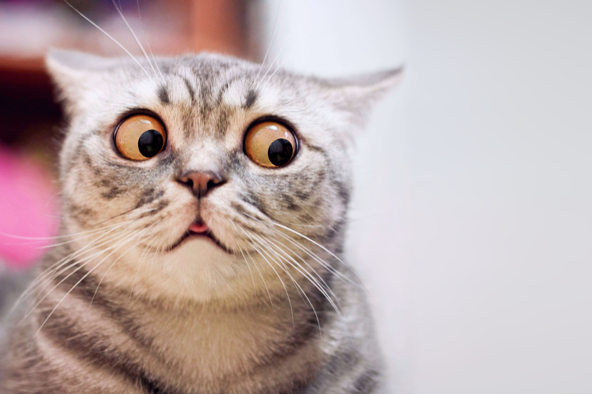

# Eyes exercise

### Project Title: 
Eyes exercise

### Description of Project
The project is a simple webpage that displays a pair of eyes that follow the movement of the mouse cursor. 
The challenge was to use the original code in order to have two eyes. 

Which initially was done but in order to ensure the eyes remain attached to the background image and visible on the screen while also allowing them to resize with the viewport, several adjustments were made to the project:  
<ul>
  <li>The HTML code was modified to include two .eye elements, one with the class left-eye and one with the class right-eye.</li>
  <li>The CSS code was modified to style both .eye and .ball elements, and to adjust the positioning of the two .eye elements.</li>
  <li>The width and height properties of the .eye and .ball elements were set using viewport units (vw) so that they can resize with the viewport.</li>
  <li>The left position of the .left-eye and .right-eye elements was calculated using calc() function in CSS, to ensure that both eyes are always visible in the viewport.</li>
</ul>

These modifications enabled the eyes to remain in position on the cat's face, while maintaining a consistent visual appearance across different device screen sizes. 

### How to Run
Fork the repo or clone it to your local machine. 

### Roadmap of future improvements: 
In progress... 

### License information
See licence file

